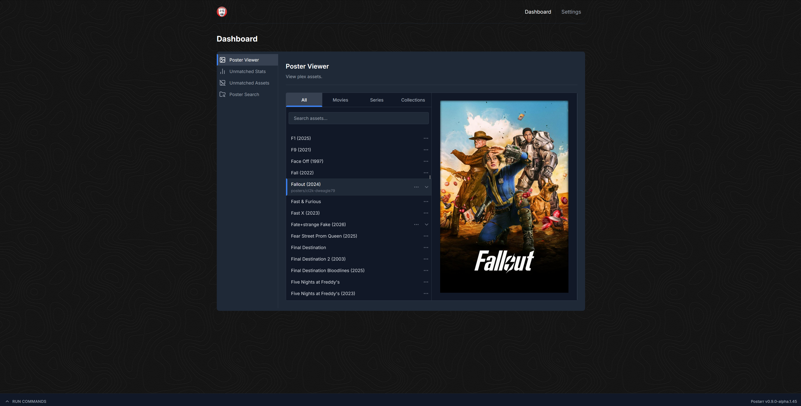

<h1 align="center">
  <br/>
  postarr
</h1>

<p align="center">Transform your Plex library with beautifully matched custom posters</p>

<p align="center">&nbsp;</p>

<p align="center"></p>

## Table of Contents

1. [What Is Postarr?](#what-is-postarr)
2. [Key Features](#key-features)
3. [Installation](#installation)
   - [Docker Compose](#docker-compose)
4. [Community](#community)
5. [Contributing](#contributing)
   - [Bug Reports and Feature Requests](#bug-reports-and-feature-requests)

## What Is Postarr?
Postarr syncs poster files from any gdrive, matches them with your Plex media items, renames them to a specific naming scheme and uploads them to your Plex server.

## Key Features

- Sync posters from any Google Drive or community drives with RClone
- Integrates with Kometa and matches poster files to Plex items, renaming them to a specific naming scheme (Kometa)
- Upload matched poster files to Plex automatically
- Webhook support with the *arr apps to upload posters as soon as media is added
- Display unmatched assets (no posters made yet) and unmatched stats
- Search drive folders directly in the UI with thumbnails
- Display all matched and uploaded poster files

## Installation
Currently only docker is supported (may provide other installation methods down the road).

### Docker Compose
Modify accordingly if running with Unraid or other methods.

- MAIN_LOG_LEVEL is optional
- Host port mapping might need to be changed to not collide with other apps
- Change `BASE_DOCKER_DATA_PATH` to match your setup. (e.g. `/mnt/user/appdata`)
- Set custom network if needed
- Set ENV variables PUID and PGID to have postarr run as a specific user/group (default is `1000:1000`)

Create `docker-compose.yml` and add the following. If you have an existing setup change to fit that.

```yml

services:
  postarr:
    container_name: postarr
    image: ghcr.io/zarskie/postarr:develop
    restart: unless-stopped
    environment:
      - TZ=${TZ}
      - PUID=${PUID}
      - PGID=${PGID}
      - MAIN_LOG_LEVEL=INFO
    volumes:
      - ${BASE_DOCKER_DATA_PATH}/postarr/config:/config
      - /path/to/drive/folders:/posters
      - /path/to/asset/folder:/assets
    ports:
      - 8000:8000
```

Then start with:

```bash
docker compose up -d
```

### Environment Variables

The following environment variables can be used:

| Variable                               | Description                                              | Default                                  |
|----------------------------------------|----------------------------------------------------------|------------------------------------------|
| `MAIN_LOG_LEVEL`                       | Web UI Log Level                                         | `INFO`                                   |
| `TIME_FORMAT`                          | Time format (12/24)                                      | `12`                                     |

## Community
For support, join the friendly Trash Guides Community [TRaSH-Guides Discord](https://trash-guides.info/discord) and look for **Postarr** under community apps.

## Contributing
- If you want to contribute please reach out on the Trash Guides discord. 
- If you want your drive added as a template please submit a pull request to the `develop` branch in the `drives.json` file.

### Bug Reports and Feature Requests 
Please create a github issue.
